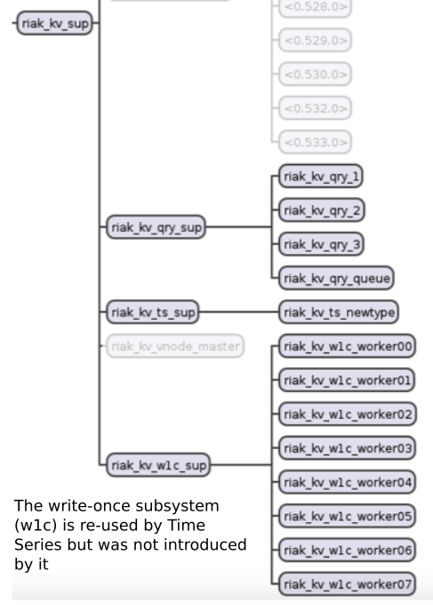

The Query Sub-System
--------------------

Time Series introduces new elements into the supervision tree of `riak_kv`

The `riak_kv_qry_sup` and its subsystem handles `SELECT` queries.

The `riak_kv_ts_sup` and its sub-system is used in when a new Time Series table is created on the cluster - the new table defintion is gossiped around using `riak_core` and this subsystem compiles new table defintions into the helper modules that are required to make riak understand them.

The `riak_kv_w1c_sup` and its subsystem is the *normal* write-once path for `riak_kv` - which is used to write immutable data. Time Series data is immutable - and it uses this path.

