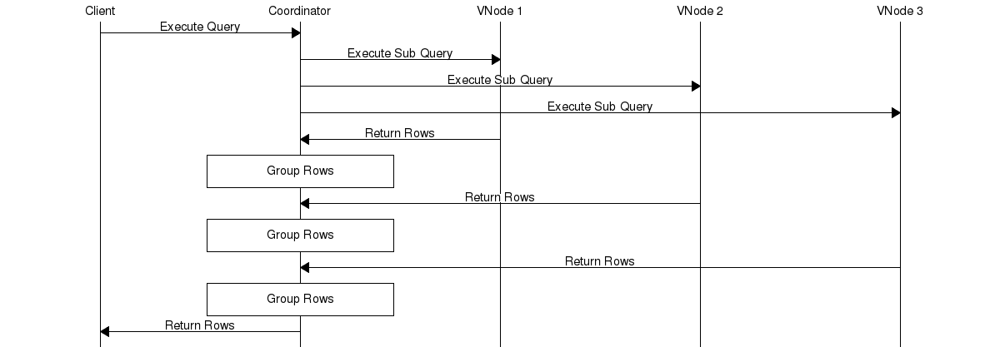

# GROUP BY Queries

You can view this document as a prezzo at:
http://remarkjs.com/remarkise

---

## Caveat Lector

This documentation assumes that you understand Time Series from a user perspective and have read the documentation on it on the main Basho Documentation Site:
http://docs.basho.com

---

## Overview

This document outlines how the `GROUP BY` clause in an SQL `SELECT` statement is implemented.

Queries like:

```sql
SELECT project, COUNT(name)
FROM tasks
WHERE completed > 1 AND completed < 1000 AND name = 'wheels' 
AND project = 'Mars Rover'
GROUP BY project;
```

---

### Definition

`GROUP BY` returns a single row for each unique combination of values for columns specified in the `GROUP BY` clause.  The `SELECT` clause for queries that use `GROUP BY` can contain only the columns in the `GROUP BY` and aggregate functions. Columns not used as groups can appear as function parameters.

The following table defines a schema for tasks, which project they are part of and when they were completed.

```sql
CREATE TABLE tasks (
    name VARCHAR NOT NULL,
    project VARCHAR NOT NULL,
    completed TIMESTAMP NOT NULL,
    subtask VARCHAR NOT NULL,
    duration SINT64 NOT NULL,
    PRIMARY KEY((name,project,quantum(completed,1,'m')),name,project,completed)
);
```

---

### Examples

The query below returns one column per unique project and counts how many rows have the same project.

```sql
SELECT project, COUNT(name)
FROM tasks
WHERE completed > 1 AND completed < 1000 AND name = 'wheels' AND project = 'Mars Rover'
GROUP BY project
```

---

### Other variations 1

Any number of groups, order has no effect

```sql
SELECT project, COUNT(name)
FROM tasks
WHERE completed > 1 AND completed < 1000 AND name = 'wheels'
AND project = 'Mars Rover'
GROUP BY project, name
```

---

### Other variations 2

BEWARE of using a timestamp in the group, this can lead to a very large number of groups because it is likely to be unique

```sql
SELECT project, name, completed
FROM tasks
WHERE completed > 1 AND completed < 1000 AND name = 'wheels'
AND project = 'Mars Rover'
GROUP BY project, name, completed
```

---

### Other variations 3

Columns do not have to be specified, any combination aggregate functions can be used

```sql
SELECT COUNT(name)
FROM tasks
WHERE completed > 1 AND completed < 1000 AND name = 'wheels'
AND project = 'Mars Rover'
GROUP BY project, name
```

---

### Other variations 4

The column "completed" is not in the group clause but can be used as a function argument

```sql
SELECT project, COUNT(completed)
FROM tasks
WHERE completed > 1 AND completed < 1000 AND name = 'wheels'
AND project = 'Mars Rover'
GROUP BY project
```

---

### Other variations 5

The grouping column doesn't have to be in the key

```sql
SELECT AVG(duration)
FROM tasks
WHERE completed > 1 AND completed < 1000 AND name = 'wheels'
AND project = 'Mars Rover'
GROUP BY subtask
```

---

### NOTE

There is no guaranteed order for rows returned by `GROUP BY`, `ORDER BY` provides this.

---

### Technical Documentation 1

`GROUP BY` can be described as a dictionary of aggregates. When no `GROUP BY` is specified but an aggregate function is, only one row is returned. For example:

```sql
SELECT COUNT(project)
FROM table1
WHERE completed > 1 AND completed < 1000 AND name = 'datacentre'
AND project = 'Mars Rover'
GROUP BY project
```

This will return a single row.

---

### Technical Documentation 2

When a `GROUP BY` is specified, one aggregate is returned per group. Internally the coordinator maintains a dictionary, the key is the group by values and the value is the aggregate.



---

### Technical Documentation 3

For each row in the result set, the coordinator must:

1. Fetch the `GROUP BY` key from the row cells.
2. Lookup the group's aggregate in the dictionary using the key.
    1. If no group exists for that key, create the initial state for the group's aggregate. 
3. "Fold" the row into the aggregate.
4. Put the aggregate back into the dictionary using the group key.

---

### Pseudo SQL

At each vnode this SQL is run

```sql
[$vnode-select =
    SELECT *
    FROM table1
    WHERE name = 'wheels' AND project = 'Mars Rover' AND completed > 230000
    AND completed completed < 330000
]
```

Then on the co-ordinator this is run
```sql
[$finalise =
    SELECT COUNT(project)
    FROM [$vnode-select]
    GROUP BY project
]
```

---

### Output

The `GROUP BY` key is a list of cell values, Given the the row and query, for the `tasks` table.

```
|   name  | project | completed |
|---------|---------|-----------|
| groupby | TS      |      5000 |
```

```sql
SELECT name, project
FROM tasks
GROUP BY name, project
```

The `GROUP BY` key for the row would be `[<<"groupby">>, <<"TS">>]`.

---

### Overload Protection

There is no special overload protection for queries using GROUP BY. It is not possible to put them into temporary tables because the accumulated groups all need to be in memory to be group on when processing new rows.

---

FIN