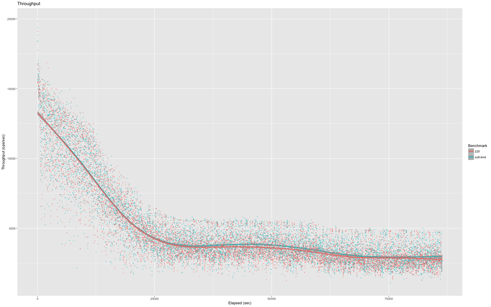

# Smarter Coordinator Selection with Vnode Queue Soft Limits

The NHS care a great deal about predictable and dependable latencies
for their Spine II deployment of Riak. This post is about some work
recently completed that aims to minimise the extremes of latency
variation for put operations.

## Coordinated Puts

Since Riak 1.0 PUTs have been coordinated by a vnode on the
preflist. This work brought the responsibility for actor management
from the client to Riak (here's a post about
[vnode vclocks](http://basho.com/posts/technical/vector-clocks-revisited/).)
Coordinated Puts means that a vnode on the preflist is chosen to first
update the version vector, and store the object, before the value is
replicated to the remaining N-1 vnodes on the preflist.

### Picking a Coordinator

In riak-2.2.5 and previous versions since riak-1.0 the coordinator has
been chosen by a very simple alogrithm:

- if the node receiving the put request is in the preflist, it
  coordinates
- otherwise, pick a node at random from the prefist

### Vnode Proxies, Queues, and Overload

Riak-1.3 came with
[Overload Protection](https://github.com/basho/riak/blob/develop/releasenotes/riak-1.3.md#overload-protection--work-shedding). Provided
mainly by the module `riak_core_vnode_proxy`.

The vnode is the main actor in a riak cluster, it wraps the individual
key/value store instances, and serialises access, so that a causal
frontier can be generated. The vnode is an Erlang process, and has an
Erlang mailbox queue of messages.

The vnode proxy's job is to pass messages to the vnode, keeping a
rough estimate of the size of the vnode mailbox. Every `5000` messages
the vnode proxy will send a `ping` message of it's own to the
vnode. When the vnode replies, the vnode proxy updates it's estimate
of the vnode queue, knowing all messages before the `ping` have been
handled. If the proxy estimates the vnode mailbox is over `10,000`, it
stops forwarding messages to the vnode, instead returning an overload
error, giving the vnode time to clear the backlog.

### Picking a Coordinator II

A 10,000 message backlog is long. If it takes 1ms for a vnode to
perform a put operation, an un-overloaded vnode that is busy can take
4 orders of magnitude longer to service a request than an idle
vnode. Quite a variation is response times.

The vnode proxy's queue estimate is too vague. After `5000` messages
it sends a `ping`. Up until that point it estimates the vnode queue
length is `4999`. It might be `0` or `4999`, or anything inbetween.

By changing the `riak_core` variable `vnode_check_interval` to just
`50` we get a far more accurate estimate of the vnode queue length, at
the expense of more frequent `ping-pong` exchanges between the proxy
and vnode. By exposing the estimate via a function call, the put FSM
can use the vnode queue estimates to select a coordinator.

Now the algorithm for picking a coordinator is:

- if the put lands on a node in the preflist, check the vnode queue
  length
- if the queue is below the `soft-limit` (e.g. 100) coordinate locally
- if the queue is over the `soft-limit` or no local vnode is in the
  preflist, cast in parallel to the remote vnodes in the preflist
- the first remote vnode to respond below the `soft-limit` gets to coordinate
- if no remote vnode is below the `soft-limit` coordinate locally (if
  the local vnode replied in time) or pick the lowest remote queue
- if no vnode responds in time, pick one at random (i.e. fallback to
  old behaviour)

### Results

We ran two 24hr [basho-bench]() load tests with the new code and
compared to previous benchmarks from the riak-2.2.5 release
cycle. Throughput was not negatively impacted, and may have shown a
slight improvement (see thoughput graph).

For put and update (fetch then put) operations, the 99th and above
percentiles showed marked improvement (see latencies) graph.

Typical network message RTT for the cluster under test was 0.2ms. With
a timeout of 100ms, over a 24hr load test, only once was the timeout
triggered and the worst case random vnode chosen. Given that a vnode
queue of even modest length introduces more latency than the full
timeout, it looks like a reasonable trade-off.

### Todo

We still need to benchmark against bitcask.

## Summary

